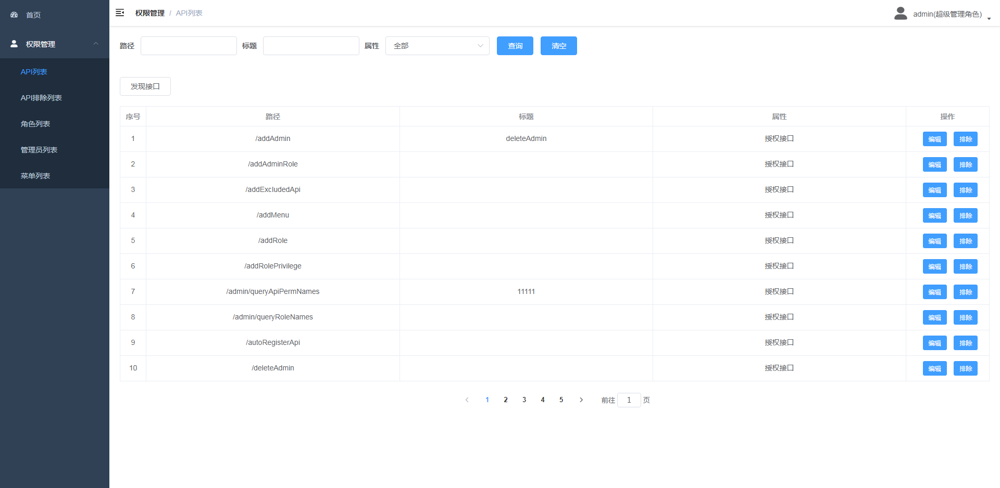
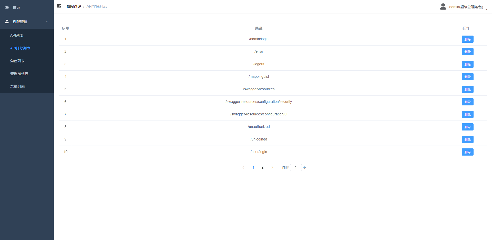
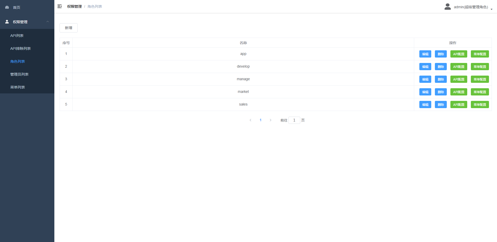
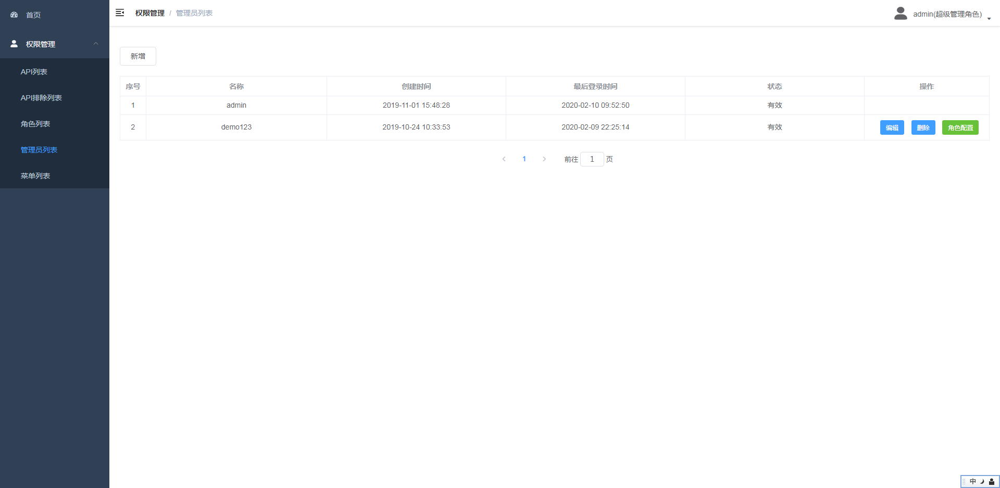
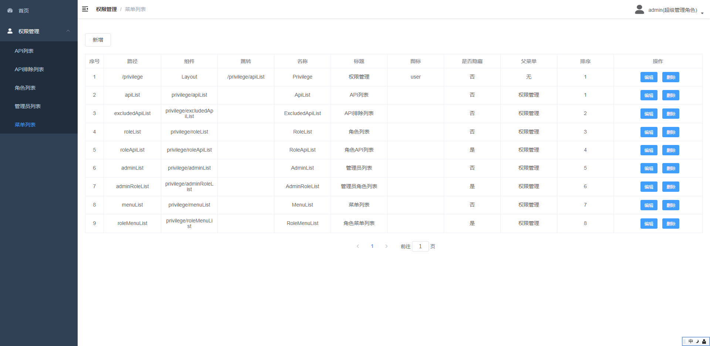

## 功能
1. 实现了一个接口对应一个权限,权限从数据库里动态加载
2. 实现了系统里的接口自动发现,也可在管理里手动排除(不做权限验证,比如登录地址,swagger地址)
3. 实现了前端菜单基于菜单权限过滤,前端按钮基于接口权限过滤,接口权限由shiro根据接口uri过滤
4. 使用redis存储session,实现分布式session
5. 实现了用户名密码登录,微信授权登录,短信验证登录

## 配置
1. application.yml里配置redis和mysql
2. usermanager.sql为数据库初始化脚本
3. 端口号可以在启动命令里配置,我用的是-Dserver.port=8090

## 截图

## api接口文档
http://localhost:8090/swagger-ui.html#/

## 前端
1. 源代码 https://github.com/jevislee/ac_vue_admin
2. 访问地址 http://localhost:8080/#/
